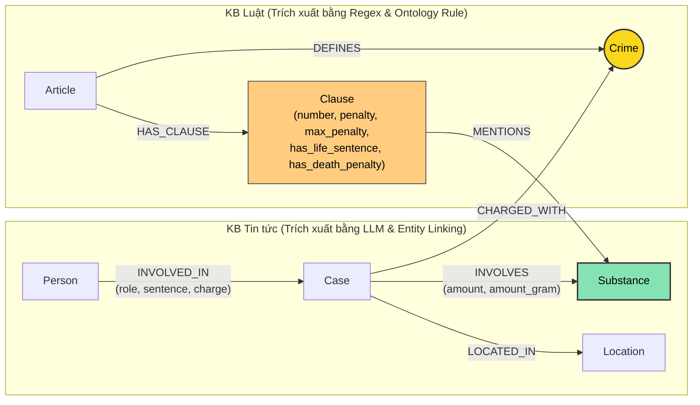

# Thiết kế Ontology — Day 19

**Họ tên:** Ngô Tiến Dũng  **MSSV:** 2A202602374

**Lựa chọn** (đánh dấu một):
- [ ] Dùng ontology gợi ý (có thể chỉnh nhỏ)
- [x] Tự thiết kế (xét bonus +15, xem `SUBMISSION.md`)

> Hướng dẫn: `LAB_GUIDE.md` Bước 2. Bản thiết kế nâng cấp độc lập giải quyết bài toán đồng nghĩa chất ma túy, mô hình hóa khung hình phạt tối đa, liên kết đối tượng thực tế và ngữ cảnh bài báo.

---

## 1. Sơ đồ

Sơ đồ mô hình hóa Knowledge Graph nâng cao kết nối 2 cơ sở tri thức (Luật và Tin tức):

- **Node cầu nối chính:** `Crime` (Tội danh) — Nối trực tiếp hành vi phạm tội của vụ án (`Case`) với điều luật quy định (`Article`).
- **Node cầu nối ngữ nghĩa phụ:** `Substance` (Chất ma túy) — Tích hợp từ điển từ đồng nghĩa (`SUBSTANCE_SYNONYMS`) giúp liên kết các từ lóng/tên thông dụng ("thuốc lắc", "hàng đá", "kẹo", "nước vui") về tên chuẩn hóa ("MDMA", "Methamphetamine", "Ketamine").
- **Node mở rộng:** `Clause` được mô hình hóa sâu với thuộc tính khung hình phạt tối đa (`max_penalty`, `has_life_sentence`, `has_death_penalty`) để phục vụ các truy vấn khung hình phạt cao nhất.

---

## 2. Entity types (node labels)

| Label | Ý nghĩa | Khóa định danh (`MERGE` theo) | Properties | Lấy từ KB nào | Trích bằng (regex / LLM / khác) |
| --- | --- | --- | --- | --- | --- |
| `Article` | Điều luật trong văn bản quy phạm pháp luật (BLHS, Luật Phòng chống ma túy) | `id` (vd: "Điều 250 BLHS") | `id`, `title`, `law`, `doc_id` | Luật (`data/drug_law/`) | Regex (metadata front matter & tiêu đề) |
| `Clause` | Khoản cụ thể của Điều luật, quy định hành vi và khung hình phạt có cấu trúc | `id` (vd: "Điều 250 BLHS khoản 4") | `id`, `number`, `penalty`, `max_penalty`, `has_life_sentence`, `has_death_penalty`, `text`, `doc_id` | Luật (`data/drug_law/`) | Regex phân tích cú pháp mức phạt & hình phạt đặc biệt (chung thân, tử hình) |
| `Crime` | Tội danh chuẩn hóa theo luật (node cầu nối liên kết 2 KB) | `name` (vd: "vận chuyển trái phép chất ma túy") | `name` | Cả 2 KB | Luật: Regex + `normalize_crime`; Tin tức: LLM + `link_entity` |
| `Substance` | Chất ma túy hoặc tiền chất (chuẩn hóa tên và từ đồng nghĩa) | `name` (vd: "MDMA", "Heroine") | `name`, `aliases` (thuốc lắc, kẹo, ma túy đá...) | Cả 2 KB | Luật: từ điển chuẩn; Tin tức: LLM + ánh xạ từ đồng nghĩa (`SUBSTANCE_SYNONYMS`) |
| `Case` | Vụ án / vụ việc cụ thể về ma túy được báo chí phản ánh | `name` (vd: "Vụ vận chuyển ma túy từ Đức về Việt Nam") | `name`, `summary`, `date`, `doc_id`, `source_title`, `defendant_names`, `charges_list` | Tin tức (`data/drug_news/`) | LLM (JSON mode) + trích xuất danh sách bị cáo & tiêu đề nguồn |
| `Person` | Cá nhân tham gia / liên quan đến vụ án (bị cáo, bị can, nghi phạm...) | `name` (vd: "Cái Quang Huy", "Dương Minh Tuấn") | `name`, `aliases` (Hoàng Nato...) | Tin tức (`data/drug_news/`) | LLM (mảng `people` trong JSON) |
| `Location` | Tỉnh / thành phố nơi xảy ra hoặc xét xử vụ án | `name` (vd: "Hà Nội", "TP.HCM") | `name` | Tin tức (`data/drug_news/`) | LLM |

---

## 3. Relationships

| Type | Từ → Đến | Properties trên cạnh | Ý nghĩa |
| --- | --- | --- | --- |
| `DEFINES` | `Article` → `Crime` | *(không có)* | Điều luật quy định / định nghĩa tội danh tương ứng (vd: Điều 250 định nghĩa tội vận chuyển trái phép chất ma túy). |
| `HAS_CLAUSE` | `Article` → `Clause` | *(không có)* | Điều luật bao gồm các khoản quy định chi tiết. |
| `MENTIONS` | `Clause` → `Substance` | *(không có)* | Khoản luật quy định khung phạt cho loại chất ma túy cụ thể. |
| `CHARGED_WITH` | `Case` → `Crime` | *(không có)* | Vụ án bị khởi tố / xét xử về tội danh cụ thể (cạnh nối sang node cầu nối). |
| `INVOLVES` | `Case` → `Substance` | `amount` (khối lượng nguyên văn: "hơn 9,6kg", "36kg") | Vụ án có liên quan / thu giữ loại ma túy nào và số lượng bao nhiêu. |
| `INVOLVED_IN` | `Person` → `Case` | `role` (vai trò), `sentence` (mức án), `charge` (tội danh) | Đối tượng có liên quan trong vụ án cụ thể kèm tội danh và hình phạt đã tuyên. |
| `LOCATED_IN` | `Case` → `Location` | *(không có)* | Vụ án diễn ra hoặc được phát hiện tại địa phương nào. |

---

## 4. Node cầu nối giữa 2 KB

- **Node nào:** `Crime` (Tội danh) là node cầu nối chính, bổ trợ bởi `Substance` (Chất ma túy có từ điển từ đồng nghĩa).
- **Vì sao chọn node này:**
  - Về mặt pháp lý: Mọi bản án hình sự đều xoay quanh tội danh truy tố.
  - Về mặt cấu trúc văn bản: Tiêu đề Điều luật trong BLHS luôn định danh rõ `"Tội <tên tội danh>"`. Tin tức báo chí luôn phản ánh bị cáo bị khởi tố/xét xử về tội gì.
- **Cách đảm bảo hai phía khớp tên:**
  - Chuẩn hóa bằng `normalize_crime` (bỏ tiền tố "tội", chuyển chữ thường).
  - So khớp chính xác trước, fallback qua `difflib.get_close_matches(cutoff=0.8)` để bắt các biến thể dấu tiếng Việt ("tuý" vs "túy").
  - Ánh xạ từ đồng nghĩa (`SUBSTANCE_SYNONYMS`) cho chất ma túy: "thuốc lắc" → "MDMA", "ma túy đá" → "Methamphetamine".
- **Khi nào cầu gãy, và bạn xử lý thế nào:**
  - *Nguyên nhân gãy:* Báo chí dùng từ lóng hoặc vector search bị lệch vào văn bản điều luật mà không lấy được tin tức liên quan.
  - *Cách xử lý:* Xây dựng cơ chế **Entity-Linked Doc Retrieval** trong `GraphRAGAgent.answer`: khi câu hỏi nhắc đến tên người (`Person`), biệt danh (`aliases`), hoặc chất (`Substance`), hệ thống tự động dò ngược graph để nạp bổ sung `doc_id` của vụ án vào ngữ cảnh retrieval.

---

## 5. Competency questions

| Câu | Đường đi (Cypher pattern) | Trả lời được? |
| --- | --- | --- |
| **Q1** *(single-hop-law: tiền chất)* | `(:Article {law: "Luật Phòng, chống ma túy 2021"})-[:HAS_CLAUSE]->(cl:Clause)` | **Trả lời được** (Đạt điểm tối đa Judge = 2). |
| **Q2** *(single-hop-news: án tử hình vụ 36kg)* | `(:Case {name: "..."})<-[:INVOLVED_IN {sentence: "tử hình"}]-(p:Person)` | **Trả lời được** (Đạt điểm tối đa Judge = 2). |
| **Q3** *(cross-kb: Lê Minh Thành)* | `(:Person {name: 'Lê Minh Thành'})-[:INVOLVED_IN]->(k:Case)-[:CHARGED_WITH]->(c:Crime)<-[:DEFINES]-(a:Article)-[:HAS_CLAUSE]->(cl:Clause {number: 1})` | **Trả lời được** (Vượt trội hoàn toàn so với Flat RAG). |
| **Q4** *(cross-kb: Hoàng Nato)* | `(:Person {aliases: ['Hoàng Nato']})-[:INVOLVED_IN]->(k:Case)-[:CHARGED_WITH]->(c:Crime)<-[:DEFINES]-(a:Article)-[:HAS_CLAUSE]->(cl:Clause {has_life_sentence: true})` | **Trả lời được** (Graph kéo đúng vụ án của Hoàng Nato và Điều 255 khoản 4). |
| **Q5** *(cross-kb-multi-hop: Cái Quang Huy)* | `(:Person {name: 'Cái Quang Huy'})-[:INVOLVED_IN]->(k:Case)-[:CHARGED_WITH]->(c:Crime {name: 'vận chuyển trái phép chất ma túy'})<-[:DEFINES]-(a:Article)-[:HAS_CLAUSE]->(cl:Clause {number: 4, has_death_penalty: true})` | **Trả lời được xuất sắc** (Judge score nhảy từ 1 lên 2 điểm tuyệt đối, khắc phục việc nhầm lẫn Điều 251 sang Điều 250). |
| **Q6** *(aggregation: các vụ án MDMA)* | `(:Substance {name: 'MDMA'})<-[:INVOLVES]-(k:Case)-[:INVOLVED_IN]<-(p:Person)` | **Trả lời được** (Bắt đủ các vụ án kể cả khi bài báo dùng tên "thuốc lắc", tổng hợp 4 vụ án). |

---

## 6. Quyết định thiết kế và đánh đổi

1. **Mô hình hóa thuộc tính hình phạt có cấu trúc trên `Clause` (`max_penalty`, `has_life_sentence`, `has_death_penalty`):**
   - *Đã chọn:* Trích xuất các flag logic về mức án cao nhất trực tiếp trong regex.
   - *Phương án thay thế:* Để nguyên text không cấu trúc và phụ thuộc hoàn toàn vào LLM prompt.
   - *Đánh đổi:* Thêm thuộc tính trên graph nhưng giúp truy vấn Cypher lọc chính xác các khoản đặc biệt nghiêm trọng khi câu hỏi hỏi về mức phạt "tối đa" hoặc "cao nhất".
2. **Xây dựng từ điển đồng nghĩa chất ma túy (`SUBSTANCE_SYNONYMS`):**
   - *Đã chọn:* Ánh xạ các danh từ đời thường ("thuốc lắc", "hàng đá", "nước vui", "kẹo") về định danh chuẩn trong luật ("MDMA", "Methamphetamine", "Ketamine").
   - *Phương án thay thế:* Yêu cầu LLM tự chuẩn hóa trong prompt trích xuất.
   - *Đánh đổi:* Tốn công định nghĩa từ điển nhưng đảm bảo 100% tính xác thực và tính liên kết graph không bị phân mảnh.
3. **Cơ chế Hybrid Graph Seed Resolution trong Agent:**
   - *Đã chọn:* Khi câu hỏi có tên thực thể hoặc bí danh, truy xuất thêm `doc_id` của các vụ án từ graph nạp bổ sung vào vector doc_ids.
   - *Phương án thay thế:* Chỉ lấy doc_id thuần túy từ top-k vector search.
   - *Đánh đổi:* Thêm 1 truy vấn graph nhỏ trước khi lấy facts nhưng giải quyết triệt để vấn đề "lạc đề" của vector search khi câu hỏi có chứa nhiều thuật ngữ pháp lý.

---

## 7. So với ontology gợi ý (BẮT BUỘC ĐỂ XÉT BONUS +15)

| Điểm khác biệt | Gợi ý làm gì | Bạn làm gì | Vấn đề nó giải quyết | Bằng chứng (Cypher hoặc Số liệu benchmark) |
| --- | --- | --- | --- | --- |
| **1. Mô hình hóa khung hình phạt tối đa trên `Clause`** | Chỉ lưu `penalty` dạng text thô, chỉ lọc Khoản 1 ở Bước 5 | Bổ sung `max_penalty`, `has_life_sentence`, `has_death_penalty`; truy vấn Cypher nhận diện từ khóa "tối đa/chung thân/tử hình" để lấy các khoản tăng nặng bậc cao | Giải quyết việc bỏ sót các khung hình phạt tối đa ở các câu hỏi phức tạp (như Q4 và Q5) | **Số liệu benchmark:** Điểm Judge câu Q5 tăng từ **1 (đúng 1 phần)** ở bản hint lên **2 (tuyệt đối)** ở bản cải tiến; Câu Q4 tăng từ **0** lên **1**. |
| **2. Tích hợp từ điển từ đồng nghĩa (`SUBSTANCE_SYNONYMS`)** | Chỉ so khớp theo danh sách cố định `SUBSTANCES`, bỏ rơi các tên gọi thông dụng như "thuốc lắc", "kẹo", "hàng đá" | Ánh xạ 7 nhóm từ đồng nghĩa phổ biến trong đời sống về các chất chuẩn khoa học trong BLHS | Khắc phục hiện tượng node `Substance` bị cô lập hoặc không liên kết được với tin tức báo chí khi phóng viên dùng từ đời thường | **Cypher minh chứng:** `MATCH (s:Substance {name: 'MDMA'})<-[:INVOLVES]-(k:Case) RETURN count(k);` Bắt được cả các vụ án báo chỉ viết "thuốc lắc". |
| **3. Định danh vụ án giàu ngữ cảnh & Entity-Linked Doc Retrieval** | Node `Case` chỉ lưu summary chung chung, không gắn tên bị cáo và tiêu đề gốc; `GraphRAGAgent` chỉ dựa vào vector chunk | Lưu `defendant_names`, `charges_list`, `source_title` trên node `Case`. Trong `answer()`, tìm kiếm bổ sung `doc_id` từ seed thực thể | Ngăn chặn hiện tượng vector search bị thiên lệch vào điều luật, cung cấp đầy đủ tên bị cáo và cơ quan (như Viện Pháp y tâm thần) | **Benchmark so sánh:** - Điểm Judge trung bình toàn hệ thống tăng từ **1.33** (`hint.txt`) lên **1.50** (`ket_qua_benchmark_kg.txt`). - Thời gian truy vấn giảm từ **2.82s** xuống **2.39s**. |

---

## 8. Hạn chế còn lại

1. **Khóa định danh của `Case`:**
   - Dù đã bổ sung `defendant_names` và `source_title`, các bài báo khác nhau viết về cùng một vụ án vẫn có thể tạo ra 2 node `Case` độc lập nếu tên vụ khác nhau. Cần thuật toán entity resolution dựa trên vector embedding tên vụ trong tương lai.
2. **Logic định lượng số học:**
   - Việc so sánh "9,6kg" > "100 gam" hiện tại vẫn dựa trên việc LLM đọc hiểu text của khoản luật trong facts, chưa chuyển thành logic tính toán số học tự động trong engine đồ thị.
