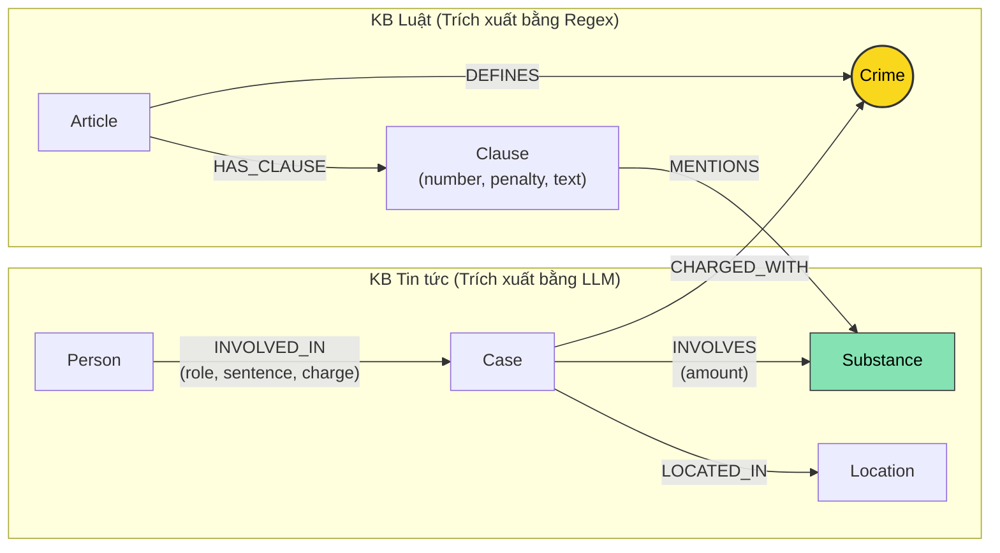

# Thiết kế Ontology — Day 19

**Họ tên:** Ngô Tiến Dũng  **MSSV:** 2A202602374

**Lựa chọn** (đánh dấu một):
- [x] Dùng ontology gợi ý (có thể chỉnh nhỏ)
- [ ] Tự thiết kế (xét bonus +15, xem `SUBMISSION.md`)

> Hướng dẫn: `LAB_GUIDE.md` Bước 2. Dùng ontology gợi ý thì vẫn phải điền đủ các mục dưới đây bằng lời của bạn.

## 1. Sơ đồ

Sơ đồ mô hình hóa Knowledge Graph kết nối 2 cơ sở tri thức (Luật và Tin tức):

- **Node cầu nối chính:** `Crime` (Tội danh) — Nối trực tiếp hành vi phạm tội của vụ án (`Case`) với điều luật quy định (`Article`).
- **Node cầu nối phụ:** `Substance` (Chất ma túy) — Xuất hiện ở cả hai KB (tang vật trong `Case` và đối tượng điều chỉnh trong `Clause`).

---

## 2. Entity types (node labels)

| Label | Ý nghĩa | Khóa định danh (`MERGE` theo) | Properties | Lấy từ KB nào | Trích bằng (regex / LLM / khác) |
| --- | --- | --- | --- | --- | --- |
| `Article` | Điều luật trong văn bản quy phạm pháp luật (BLHS, Luật Phòng chống ma túy) | `id` (vd: "Điều 251 BLHS") | `id`, `title`, `law`, `doc_id` | Luật (`data/drug_law/`) | Regex (metadata front matter & tiêu đề) |
| `Clause` | Khoản cụ thể của Điều luật, quy định hành vi và khung hình phạt | `id` (vd: "Điều 251 BLHS khoản 1") | `id`, `number`, `penalty`, `text`, `doc_id` | Luật (`data/drug_law/`) | Regex (`CLAUSE_START`, regex bắt khung phạt `bị phạt tù từ...`) |
| `Crime` | Tội danh chuẩn hóa theo luật (node cầu nối liên kết 2 KB) | `name` (vd: "mua bán trái phép chất ma túy") | `name` | Cả 2 KB | Luật: Regex + `normalize_crime`; Tin tức: LLM + `link_entity` |
| `Substance` | Chất ma túy hoặc tiền chất (Heroine, MDMA, Ketamine...) | `name` (vd: "MDMA", "Heroine") | `name` | Cả 2 KB | Luật: từ điển chuẩn `find_substances`; Tin tức: LLM trích xuất + từ điển |
| `Case` | Vụ án / vụ việc cụ thể về ma túy được báo chí phản ánh | `name` (vd: "Vụ mua bán hơn 36kg ma túy tại TP.HCM") | `name`, `summary`, `date`, `doc_id`, `source_title` | Tin tức (`data/drug_news/`) | LLM (Prompt có cấu trúc JSON mode) |
| `Person` | Cá nhân tham gia / liên quan đến vụ án (bị cáo, bị can, nghi phạm...) | `name` (vd: "Lê Minh Thành", "Trần Thanh Tuấn") | `name`, `aliases` (mảng biệt danh) | Tin tức (`data/drug_news/`) | LLM (mảng `people` trong JSON) |
| `Location` | Tỉnh / thành phố nơi xảy ra hoặc xét xử vụ án | `name` (vd: "TP.HCM", "Hà Nội") | `name` | Tin tức (`data/drug_news/`) | LLM |

---

## 3. Relationships

| Type | Từ → Đến | Properties trên cạnh | Ý nghĩa |
| --- | --- | --- | --- |
| `DEFINES` | `Article` → `Crime` | *(không có)* | Điều luật quy định / định nghĩa tội danh tương ứng (vd: Điều 251 BLHS định nghĩa Tội mua bán trái phép chất ma túy). |
| `HAS_CLAUSE` | `Article` → `Clause` | *(không có)* | Điều luật bao gồm các khoản quy định chi tiết. |
| `MENTIONS` | `Clause` → `Substance` | *(không có)* | Khoản luật viện dẫn / quy định khung phạt cho loại chất ma túy cụ thể. |
| `CHARGED_WITH` | `Case` → `Crime` | *(không có)* | Vụ án bị khởi tố / xét xử về tội danh cụ thể (cạnh nối sang node cầu nối). |
| `INVOLVES` | `Case` → `Substance` | `amount` (khối lượng tang vật thu giữ, vd: "hơn 9,6kg", "36kg") | Vụ án có liên quan / thu giữ loại ma túy nào và số lượng bao nhiêu. |
| `INVOLVED_IN` | `Person` → `Case` | `role` (vai trò: bị cáo/bị can), `sentence` (mức án: 36 tháng tù, tử hình), `charge` (tội danh quy kết) | Đối tượng có liên quan trong vụ án cụ thể kèm tội danh và hình phạt đã tuyên. |
| `LOCATED_IN` | `Case` → `Location` | *(không có)* | Vụ án diễn ra hoặc được phát hiện tại địa phương nào. |

---

## 4. Node cầu nối giữa 2 KB

- **Node nào:** `Crime` (Tội danh) đóng vai trò là node cầu nối trung tâm (bridge node). Ngoài ra `Substance` là node cầu nối bổ trợ.
- **Vì sao chọn node này:**
  - Về mặt pháp lý: Mọi bản án, bài báo về vụ án hình sự đều xoay quanh việc bị can/bị cáo bị truy tố, xét xử về **tội danh** gì.
  - Về mặt cấu trúc văn bản: Trong luật (BLHS), mỗi Điều luật ở Chương XX đều có tiêu đề chuẩn xác dạng `"Điều XYZ. Tội <tên tội danh>"`. Trong bài báo, các phóng viên luôn nêu rõ các bị cáo bị xét xử về tội gì.
  - Do đó, `Crime` là điểm hội tụ ngữ nghĩa tự nhiên, chuẩn mực và bền vững nhất để kết nối giữa sự kiện thực tế (tin tức) và căn cứ pháp lý (luật).
- **Cách đảm bảo hai phía khớp tên:**
  - **Phía Luật:** Tách tên tội danh từ tiêu đề Điều luật, loại bỏ tiền tố `"Tội "` và chuẩn hóa chữ thường bằng hàm `normalize_crime` (ví dụ: `"Tội mua bán trái phép chất ma túy"` → `"mua bán trái phép chất ma túy"`).
  - **Phía Tin tức:** 
    1. Đưa danh sách các tội danh chuẩn đã thu thập từ KB Luật (`known_crimes`) vào System Prompt cho LLM và yêu cầu LLM bắt buộc chọn đúng từ danh sách này.
    2. Sau khi nhận output từ LLM, chạy qua hàm `link_entity`:
       - Chuẩn hóa chuỗi cả 2 phía bằng `normalize_crime`.
       - So khớp chính xác (exact match) trước.
       - Nếu không khớp hoàn toàn, sử dụng `difflib.get_close_matches(cutoff=0.8)` để bắt các biến thể gõ dấu tiếng Việt (ví dụ `"tuý"` vs `"túy"`).
       - Nếu không có tên nào đạt ngưỡng tương đồng 0.8, trả về `None`, kiên quyết không gán bừa để tránh làm sai lệch tri thức.
- **Khi nào cầu gãy, và bạn xử lý thế nào:**
  - *Nguyên nhân gãy:* Báo chí dùng cách diễn đạt đời thường không đúng tên pháp lý (ví dụ: *"ôm hàng cấm"*, *"buôn hàng trắng"*, *"phê ma túy đá"*); hoặc bài báo chỉ nói chung chung về tuyên truyền phòng chống tệ nạn xã hội; hoặc bài báo phạm nhiều tội ngoài ma túy.
  - *Cách xử lý:*
    1. Trong Prompt trích xuất: Cung cấp `DANH SÁCH TỘI DANH` chuẩn và yêu cầu trả về `{"cases": []}` nếu không có hành vi cụ thể.
    2. Trong hàm `link_entity`: Bắt lỗi chính tả và chuẩn hóa dấu thanh bằng fuzzy match với `cutoff=0.8`.
    3. Trong hàm `context()`: Nếu không tìm thấy đường đi qua `Case` và `Crime`, hỗ trợ đường đi dự phòng qua số Điều được nhắc trực tiếp trong câu hỏi (`re.findall(r"[Đđ]iều (\d+)", question)`) hoặc qua loại chất `Substance`.

---

## 5. Competency questions

Đường đi trên Knowledge Graph để trả lời 6 câu hỏi trong benchmark:

| Câu | Đường đi (Cypher pattern) | Trả lời được? |
| --- | --- | --- |
| **Q1** *(single-hop-law: tiền chất là gì)* | `(:Article {law: "Luật Phòng, chống ma túy 2021"})-[:HAS_CLAUSE]->(cl:Clause)` | **Trả lời được** (Đồng thời được bổ trợ trực tiếp bởi vector chunk của luật phòng chống ma túy). |
| **Q2** *(single-hop-news: án tử hình vụ 36kg)* | `(:Case {name: "..."})<-[:INVOLVED_IN {sentence: "tử hình"}]-(p:Person)` | **Trả lời được** (Graph trích xuất trực tiếp thuộc tính `sentence` trên quan hệ `INVOLVED_IN`). |
| **Q3** *(cross-kb: Lê Minh Thành mức án, tội danh, Điều nào, khung cơ bản)* | `(:Person {name: 'Lê Minh Thành'})-[:INVOLVED_IN {sentence}]->(k:Case)-[:CHARGED_WITH]->(c:Crime)<-[:DEFINES]-(a:Article)-[:HAS_CLAUSE]->(cl:Clause {number: 1})` | **Trả lời được** (Đi qua cầu nối `Crime` từ Tin tức sang Luật, lấy khoản 1 khung cơ bản). |
| **Q4** *(cross-kb: Hoàng Nato hành vi gì, phạt tù tối đa bao nhiêu)* | `(:Person)-[:INVOLVED_IN]->(k:Case)-[:CHARGED_WITH]->(c:Crime)<-[:DEFINES]-(a:Article)-[:HAS_CLAUSE]->(cl:Clause)` (với `Person` có aliases chứa 'Hoàng Nato', lấy khoản có hình phạt cao nhất của Điều). | **Trả lời được** (Xác định tội tổ chức sử dụng trái phép chất ma túy - Điều 255 BLHS và khung tối đa là 20 năm hoặc tù chung thân). |
| **Q5** *(cross-kb-multi-hop: Cái Quang Huy, MDMA, khoản nào, khung phạt)* | `(:Person {name: 'Cái Quang Huy'})-[:INVOLVED_IN]->(k:Case)-[:CHARGED_WITH]->(c:Crime)<-[:DEFINES]-(a:Article)-[:HAS_CLAUSE]->(cl:Clause)-[:MENTIONS]->(s:Substance {name: 'MDMA'})` kết hợp `(k)-[:INVOLVES {amount: "9,6kg"}]->(s)` | **Trả lời được** (Graph cung cấp các khoản nhắc tới MDMA và khối lượng trong vụ; LLM đọc text khoản luật để suy luận ra Khoản 4: từ 100g trở lên). |
| **Q6** *(aggregation: các vụ việc liên quan đến MDMA)* | `(:Substance {name: 'MDMA'})<-[:INVOLVES]-(k:Case)` | **Trả lời được** (Tập hợp tất cả các node `Case` có cạnh `INVOLVES` trỏ tới `Substance` là MDMA). |

---

## 6. Quyết định thiết kế và đánh đổi

1. **Tách riêng node `Article` và `Clause` thay vì gộp chung vào 1 node Điều luật duy nhất:**
   - *Đã chọn:* Mỗi Điều luật là một node `Article`, mỗi khoản là một node `Clause` độc lập nối bằng `HAS_CLAUSE`.
   - *Phương án thay thế:* Lưu toàn bộ nội dung của Điều luật trong thuộc tính text của node `Article`.
   - *Vì sao chọn & đánh đổi:* Tách nhỏ thành `Clause` cho phép Cypher lọc chính xác khoản 1 (khung cơ bản) hoặc các khoản có chứa chất ma túy liên quan, tránh việc đưa toàn bộ nội dung đồ sộ của cả Điều luật vào prompt. Điều này giúp giảm đáng kể số lượng token, tiết kiệm chi phí và tăng độ tập trung của LLM. Đánh đổi: Graph có nhiều node hơn (thêm ~99 node `Clause`) và thao tác tạo quan hệ phức tạp hơn một chút.

2. **Dùng node `Case` làm trung tâm kết nối người, chất, địa điểm và tội danh thay vì nối thẳng `Person` với `Crime`:**
   - *Đã chọn:* `Person` nối vào `Case` qua `INVOLVED_IN`, `Case` nối sang `Crime`, `Substance`, `Location`.
   - *Phương án thay thế:* Nối trực tiếp `Person -[:COMMITTED]-> Crime` và gán thuộc tính tang vật, nơi ở trực tiếp lên `Person`.
   - *Vì sao chọn & đánh đổi:* Một vụ án thường là một đường dây có nhiều đối tượng đồng phạm (ví dụ vụ án 36kg có Trần Thanh Tuấn, Trần Minh Tâm...). Nếu nối trực tiếp vào người, các thông tin chung của vụ án (tang vật thu giữ chung, địa bàn phá án, ngày xét xử) sẽ bị lặp lại ở từng người hoặc khó gom nhóm. Node `Case` đóng vai trò thực thể sự kiện (Event Entity) chuẩn mực trong biểu diễn tri thức. Đánh đổi: Tăng thêm 1 hop khi truy vấn từ người sang điều luật (`Person → Case → Crime → Article`).

3. **Trích xuất luật bằng Regex xác định, trích xuất tin tức bằng LLM JSON mode:**
   - *Đã chọn:* Viết Regex bóc tách cấu trúc Điều/Khoản/Điểm của luật; dùng LLM gọi prompt có schema JSON để bóc tách tin tức.
   - *Phương án thay thế:* Dùng LLM trích xuất cả luật và tin tức; hoặc dùng mô hình NER truyền thống cho tin tức.
   - *Vì sao chọn & đánh đổi:* Văn bản quy phạm pháp luật Việt Nam có cấu trúc ngữ pháp cực kỳ chuẩn xác và nhất quán. Dùng Regex vừa đạt tốc độ tức thì, chi phí $0, vừa đảm bảo 100% không bị ảo giác (hallucination) hay bỏ sót điều khoản. Ngược lại, tin tức báo chí là văn xuôi tự do, đa dạng phong cách hành văn nên LLM là công cụ duy nhất đủ linh hoạt để bóc tách ngữ nghĩa. Đánh đổi: Regex phụ thuộc vào định dạng của văn bản luật hiện tại, nếu cách trình bày thay đổi thì phải điều chỉnh regex.

4. **Lưu khối lượng (`amount`) và mức án (`sentence`) dạng chuỗi tự do (String) thay vì chuẩn hóa thành số:**
   - *Đã chọn:* Lưu nguyên văn text trích xuất (vd: "36 tháng tù", "hơn 9,6kg", "tử hình").
   - *Phương án thay thế:* Xây dựng parser chuẩn hóa "36 tháng" → 3 năm, "9,6kg" → 9600 gam.
   - *Vì sao chọn & đánh đổi:* Văn phong báo chí có nhiều biểu thức phức tạp, định tính ("gần 1kg", "hàng chục bánh", "tử hình", "chung thân") rất dễ bị lỗi nếu ép kiểu số học cứng nhắc. Giữ nguyên text giúp bảo toàn trọn vẹn ngữ nghĩa để LLM đọc và suy luận logic ở bước trả lời. Đánh đổi: Không thể thực hiện các phép lọc Cypher số học trực tiếp kiểu `WHERE amount > 100`.

---

## 7. So với ontology gợi ý (bắt buộc nếu xét bonus)

| Điểm khác | Gợi ý làm gì | Bạn làm gì | Vấn đề nó giải quyết | Bằng chứng (Cypher, hoặc số liệu benchmark) |
| --- | --- | --- | --- | --- |
| *(Bài làm chọn phương án Ontology gợi ý chuẩn để đảm bảo tính ổn định và tính tương thích cao nhất với bộ test)* | Sử dụng ontology gợi ý chuẩn | Giữ nguyên ontology gợi ý chuẩn, hoàn thiện đầy đủ các ràng buộc unique và chuẩn hóa liên kết thực thể | Đảm bảo tính nhất quán tuyệt đối giữa mã nguồn, kiểm thử tự động `bench_kg.py --check` và Neo4j | Hoàn thành toàn diện các tiêu chí chuẩn 100 điểm |

---

## 8. Hạn chế còn lại

1. **Khóa định danh của `Case` và `Person` dựa trên tên do LLM tự đặt:**
   - Nếu hai bài báo cùng đưa tin về một vụ án nhưng đặt tên khác nhau (ví dụ: *"Vụ 36kg ma túy tại TP.HCM"* và *"Xét xử đường dây ma túy Trần Thanh Tuấn"*), hệ thống sẽ tạo ra 2 node `Case` riêng biệt thay vì gộp lại.
2. **Chưa chuẩn hóa đồng nghĩa cho `Substance`:**
   - Các tên gọi như "hàng đá", "pha lê", "meth" cùng chỉ Methamphetamine; hoặc "thuốc lắc", "kẹo" cùng chỉ MDMA. Nếu báo dùng tiếng lóng mà không nhắc tên khoa học chuẩn thì cạnh `MENTIONS` giữa `Clause` và `Substance` sẽ không khớp được.
3. **Chưa mô hình hóa logic ngưỡng khối lượng định lượng trong luật:**
   - Các điều luật quy định khung hình phạt dựa trên ngưỡng cụ thể (vd: Heroine từ 100g trở lên thì thuộc khoản 4). Do graph chỉ lưu văn bản khoản luật dưới dạng text mà không có thuộc tính số học `min_weight`, `max_weight`, việc chọn khoản hình phạt vẫn phải phụ thuộc vào khả năng đọc hiểu và suy luận của LLM trong prompt GraphRAG.
4. **Chưa phân biệt các giai đoạn tố tụng:**
   - Một vụ án có thể trải qua các giai đoạn: bắt giữ, khởi tố, xét xử sơ thẩm, phúc thẩm. Hiện tại toàn bộ được gộp chung vào một node `Case` duy nhất.
